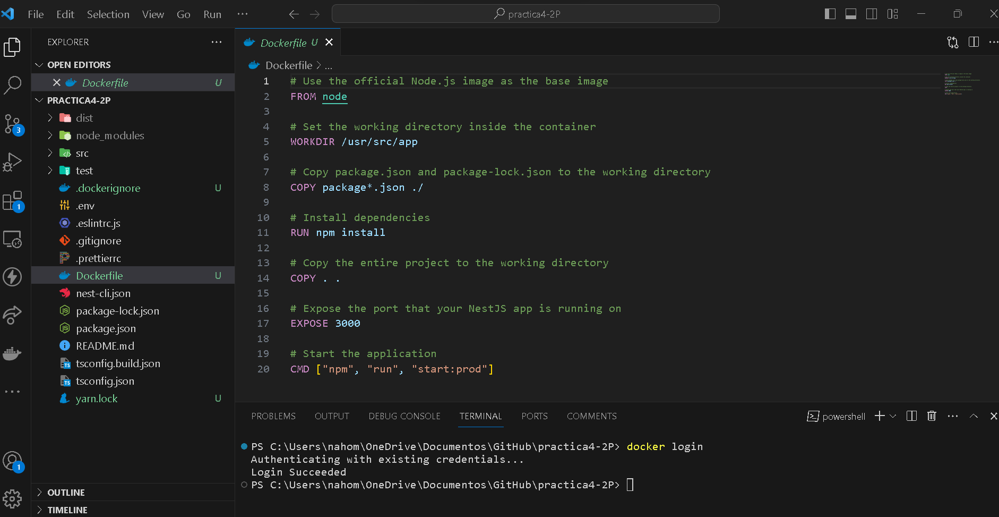

# Dockerización de Aplicación NestJS con GitHub Actions

En este repositorio, se presenta un ejemplo detallado de cómo dockerizar una aplicación NestJS y establecer un flujo de trabajo eficiente mediante GitHub Actions para la construcción y despliegue de contenedores Docker.

## Procedimiento

### 1. Creación del Repositorio

Comienza creando un repositorio en GitHub, ya sea público o privado.

### 2. Preparación del Código Fuente

Realiza un commit con el código deseado.

### 3. Configuración de Secrets en GitHub

Configura los secrets DOCKER_USER y DOCKER_PASSWORD en la sección correspondiente de Secrets en el repositorio de GitHub.

### 4. Configuración del Token de Docker Hub

Utiliza el nombre de usuario y clave (token) de Docker Hub para llenar los secrets DOCKER_USER y DOCKER_PASSWORD. Crea un Token en Docker (con el nombre Github-Actions) y copia este Token generado en el secret DOCKER_PASSWORD.

### 5. Dockerización de la Aplicación

Realiza la Dockerización de la aplicación NestJS, preferiblemente un servicio REST o GraphQL sin dependencias.

### 6. Verificación de la Construcción y Funcionamiento

Asegúrate de que la imagen pueda ser compilada.

Realiza el commit para que se ejecuten los builds automáticos.

### 7. Crear Acción de Imagen Docker

Configura un flujo de trabajo en GitHub Actions para generar la imagen Docker utilizando el archivo `docker-image.yml`.

#### Evidencias

- **El flujo de trabajo está configurado para realizar builds automáticos.**

  

- **Durante el guardado, se genera un nuevo build automáticamente.**

  

- **Build completado sin errores.**

  
